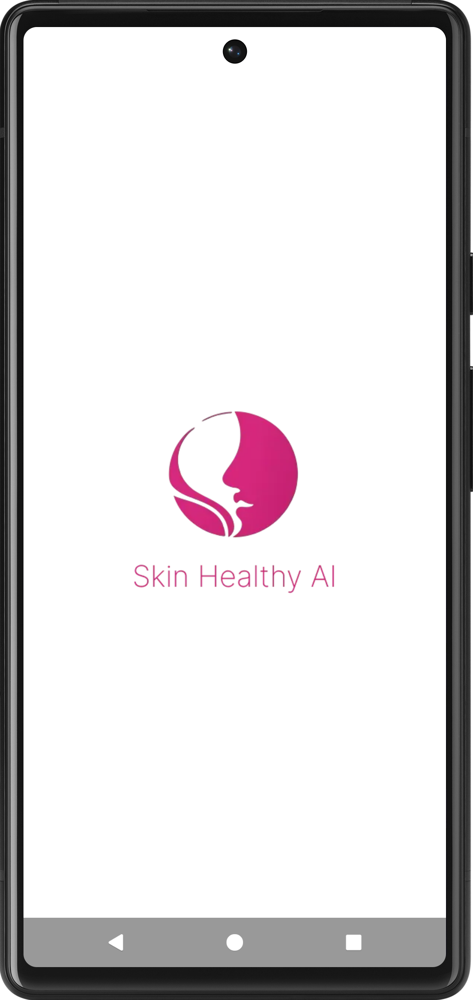
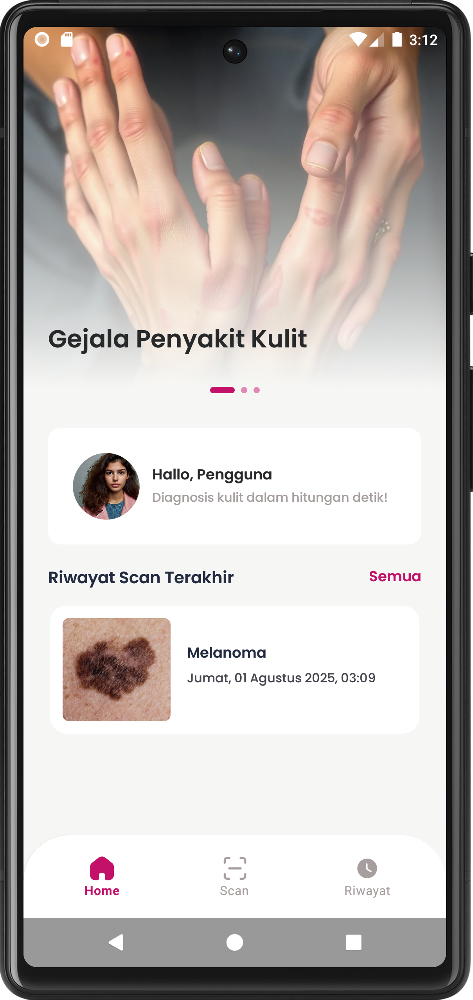
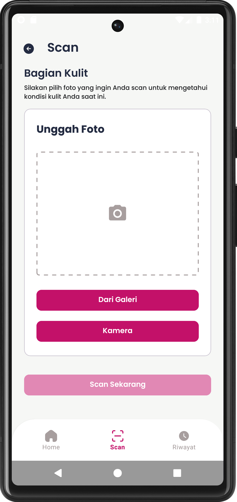
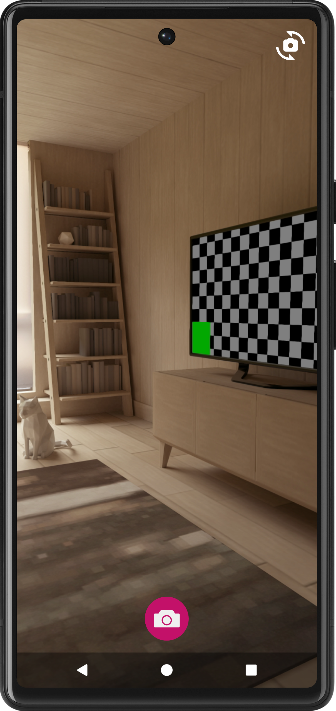
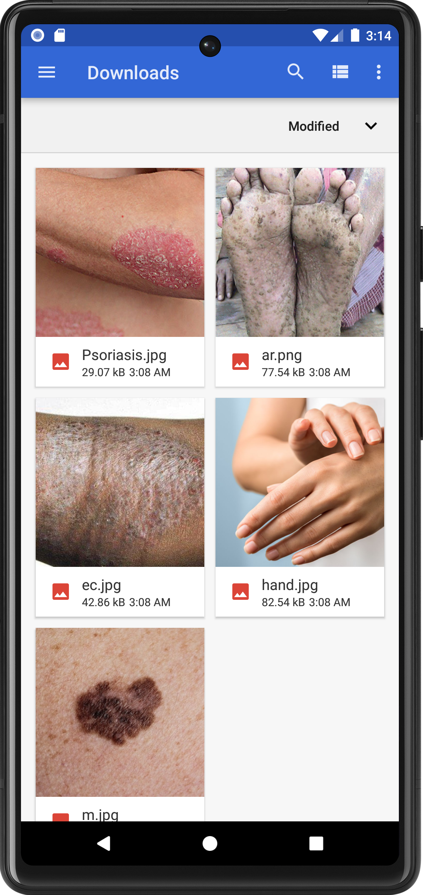
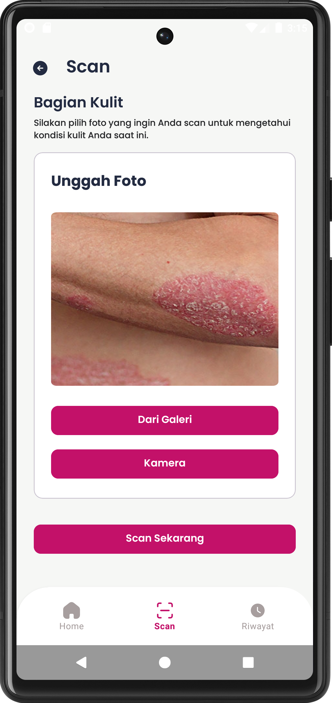
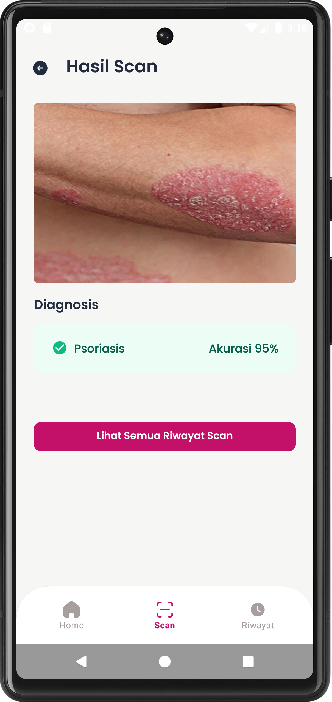
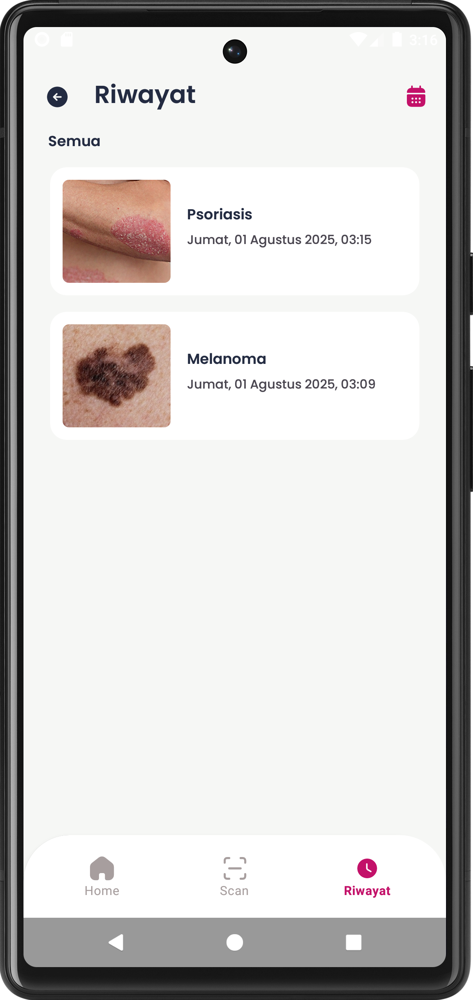
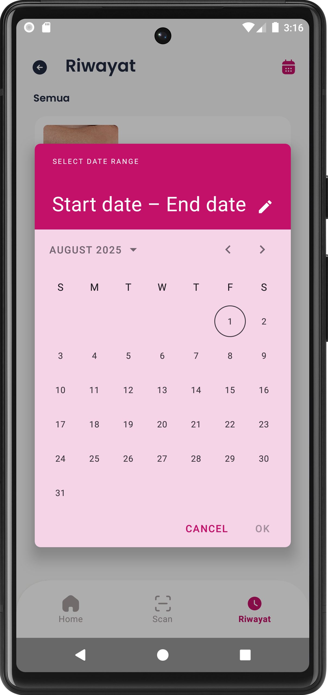

# 🧠 Skin Healthy AI  
**AI-Powered Android App for Early Skin Disease Detection (Offline, Fast, Private)**

---

## 🚀 Project Overview
**Skin Healthy AI** adalah aplikasi Android berbasis **Deep Learning** yang dirancang untuk mendeteksi penyakit kulit secara cepat, akurat, dan **100% offline** langsung dari perangkat pengguna.

Dikembangkan sebagai **Final Project (Skripsi S1 Teknik Informatika)** di Universitas Muhammadiyah Riau.

📅 **Timeline**: Nov 2024 — Aug 2025  

---

## 🎯 Why This Project Matters
Masalah yang diselesaikan:

- ❌ Akses awal ke diagnosis penyakit kulit masih terbatas  
- ❌ Ketergantungan pada koneksi internet  
- ❌ Risiko privasi dari upload gambar  

Solusi:

- ✅ On-device AI (tanpa internet)  
- ✅ Privacy-first (data tetap di device)  
- ✅ Fast inference (<1s)  

---

## 🔥 Key Features
- 📸 Scan via CameraX & Gallery  
- 🧠 CNN Model (TensorFlow Lite)  
- 🖼️ Image processing (crop, zoom, rotate - UCrop)  
- 📊 History + filter by datetime  
- 💾 Local database (Room - SQLite)  

---

## 🧱 Tech Stack
- Kotlin (Android)
- TensorFlow Lite
- CameraX
- UCrop
- Room Database
- Figma

---

## ⚙️ System Flow
User Input → Preprocessing → Tensor → Model CNN → Result → Save DB
📸 App Screenshots
🏠 Home & Splash

   
 
<i>Splash screen dan halaman utama aplikasi</i>

🔍 Scan Process

    
 
<i>Proses scan menggunakan kamera dan galeri</i>

🖼️ Image Processing

  
 
<i>Pengolahan gambar sebelum diproses oleh AI</i>

📊 Result & History

    
 
<i>Hasil deteksi dan fitur riwayat</i>

📊 Engineering Highlights
⚡ On-device ML (TensorFlow Lite)
🔐 Privacy-first architecture
📉 Tanpa API (low latency)
🧩 Modular design
📱 Support Android 8+
⚠️ Disclaimer

Aplikasi ini hanya untuk deteksi awal, bukan diagnosis medis profesional.

👨‍💻 Author

Muhammad Ravi
Android Developer | Machine Learning Enthusiast
